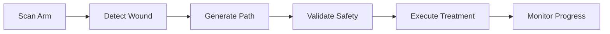

# Plasma Jet Path Planner

**Intelligent path planning system for cold atmospheric plasma (CAP) wound healing**

[](https://www.python.org/downloads/)
[](LICENSE)

## Overview

This project combines 3D scanning, path planning, thermal safety monitoring, and visualization to safely apply cold atmospheric plasma treatment to biological tissue. The system:

- 📷 **Scans** arm geometry with Intel RealSense L515
- 🔍 **Detects** wound regions (manual/automatic)
- 🗺️ **Plans** optimal plasma jet toolpaths
- 🛡️ **Validates** thermal safety constraints
- 🤖 **Executes** via G-code on robot arm
- 📊 **Monitors** treatment progress in real-time

## Quick Start

```bash
# Clone repository
git clone <repository-url>
cd ASWY_NexHacks

# Install backend
pip install -r requirements.txt
pip install -e .

# Install frontend
cd frontend && npm install

# Run demo
python run_full_pipeline.py --demo
```

## Key Features

### 🎯 Automated Path Planning
- Raster pattern generation
- Surface-following with normal calculation
- Bidirectional zigzag for efficiency
- Configurable standoff distance and line spacing

### 🌡️ Thermal Safety
- Predictive thermal modeling
- Real-time temperature monitoring
- Automatic speed adjustment
- Emergency stop on threshold violation

### 🎨 Rich Visualization
- Interactive 3D point cloud viewer
- Toolpath preview with normals
- Multiple view angles
- Export capabilities (PNG, PDF, G-code)

### 🔧 Modular Architecture
- Clean separation of concerns
- Easy to extend and customize
- Well-documented codebase
- Comprehensive testing

## Project Structure

```
ASWY_NexHacks/
├── backend/           # Python core modules
│   ├── scanning/     # 3D capture with RealSense
│   ├── path_planning/ # Toolpath generation
│   ├── safety/       # Thermal safety system
│   ├── visualization/ # Interactive viewers
│   └── utils/        # Shared utilities
├── frontend/         # React web interface
├── config/           # YAML configuration files
├── data/             # Generated outputs
│   ├── scans/       # Point clouds (.ply)
│   ├── surfaces/    # Surface models (.pkl)
│   ├── toolpaths/   # G-code files
│   └── results/     # JSON results
├── docs/             # Documentation
└── tests/           # Test suites
```

## Documentation

- 📖 **[Setup Guide](docs/SETUP.md)** - Installation and configuration
- 🎓 **[Usage Guide](docs/USAGE.md)** - How to use the system
- 🏗️ **[Architecture](docs/ARCHITECTURE.md)** - System design and modules
- 👨‍💻 **[Development](docs/DEVELOPMENT.md)** - Contributing guidelines

## Workflow



1. **Scan**: Capture 3D point cloud with RealSense L515
2. **Detect**: Identify wound region (manual or automatic)
3. **Plan**: Generate raster toolpath with optimal parameters
4. **Validate**: Check thermal and spatial safety constraints
5. **Execute**: Send G-code to robot arm for treatment
6. **Monitor**: Track progress and safety metrics in real-time

## Hardware Requirements

- Intel RealSense L515 camera
- USB 3.0 port
- Python 3.10+ (3.12 recommended)
- 8GB+ RAM recommended
- Windows/Linux/macOS

## Example Usage

### Scan an Arm

```bash
python run_scanner.py
# Press 'S' to save point cloud
```

### Generate Toolpath

```bash
python run_planner.py --input data/scans/pcd_20260117_120000.ply
```

### Visualize Results

```bash
python run_visualizer.py
# Load JSON results from data/results/
```

### Run Web Interface

```bash
cd frontend
npm run dev
# Navigate to http://localhost:5173
```

## Configuration

All parameters are configurable via YAML files in `config/`:

- `camera_defaults.yaml` - Camera settings
- `path_planning_defaults.yaml` - Toolpath parameters  
- `safety_thresholds.yaml` - Safety limits
- `robot_config.yaml` - Robot arm settings

## Technology Stack

| Component | Technology |
|-----------|-----------|
| 3D Scanning | Intel RealSense L515 |
| Point Cloud | Open3D |
| Surface Model | RBF Interpolation (SciPy) |
| Safety | Linear Regression (NumPy) |
| Backend | Python 3.10+ |
| Frontend | React + TypeScript + Three.js |
| UI Components | shadcn/ui + Tailwind CSS |

## Safety Features

- ✅ Predictive thermal model (5-second lookahead)
- ✅ Real-time temperature monitoring
- ✅ Automatic speed/stop recommendations
- ✅ Configurable safety thresholds
- ✅ Emergency stop capability
- ✅ Comprehensive logging

## Team

**ASWY NexHacks Team**

- 3D Scanning & Computer Vision
- Path Planning & Optimization
- Thermal Safety & Control
- Web Development & Visualization

## License

Copyright © 2026 ASWY NexHacks Team

## Acknowledgments

- Intel RealSense SDK
- Open3D library
- React and Three.js communities
- NexHacks hackathon organizers

## Contact

For questions, issues, or collaboration opportunities, please create an issue or contact the team.

---

**Status**: Active Development | **Version**: 1.0.0 | **Last Updated**: January 2026
